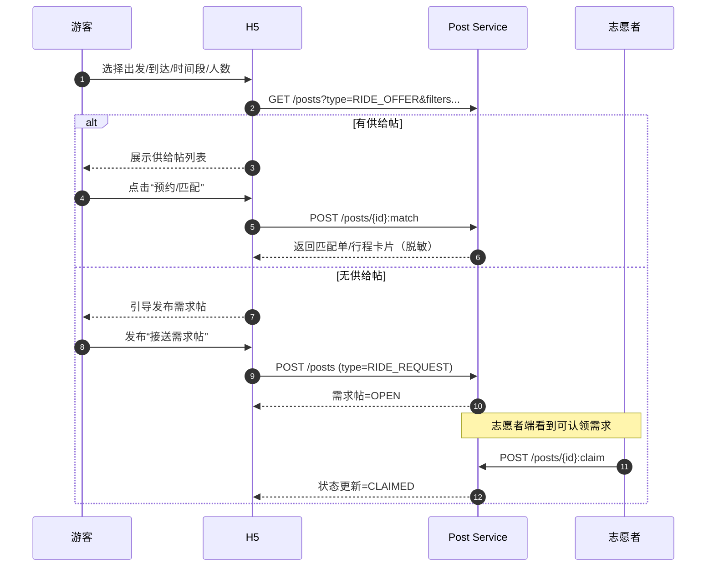
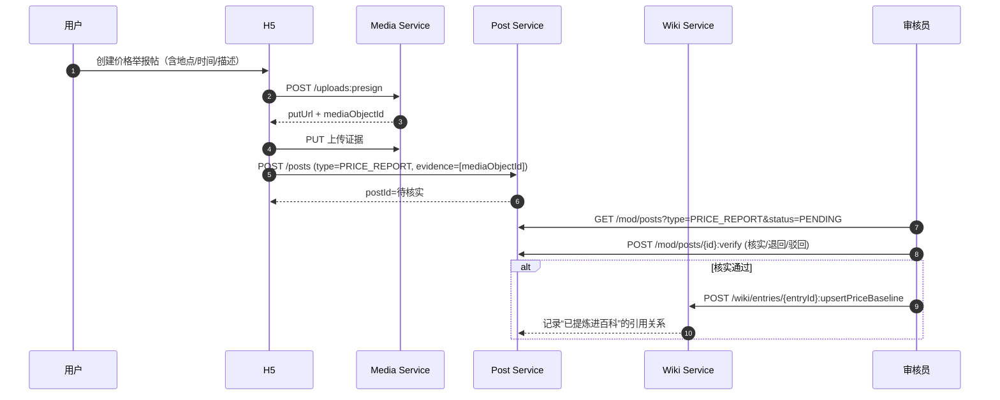
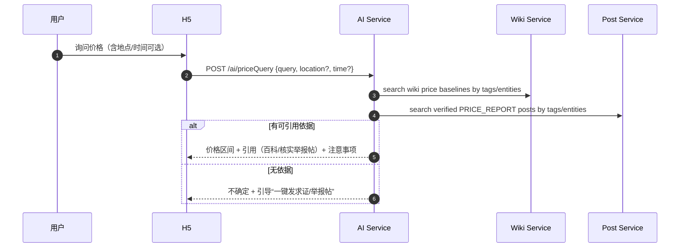

# MVP P0：免费接送 + 价格举报 + AI 查价（基于“百科 + 图文帖子”）

> 目标：用最少的“内容模型”跑通闭环：  
> - **百科（Wiki）**沉淀可引用事实（含旅游保障：物价/房价/车价基准、避坑套路等）  
> - **图文帖子（Post）**承载供需对接与即时信息（免费接送、价格举报/求证、经验分享等）  
> 时间线/地图/AI 都是上述两套内容的“视图/能力”，不再拆成独立业务体系。

## 1. 核心模型（P0 必须先定）

### 1.1 百科（Wiki）

- 特点：结构化、可审核、可版本化、可被 AI/产品“引用”
- P0 至少支持两类词条：
  1) **价格基准/避坑**（例：甘草水果的常见规格与价格区间、酒店临时加价套路、出租车一口价陷阱）
  2) **服务点/集合点**（免费接送上车点等；带地理坐标，后续可直接在地图页展示）
- 分类方式：**标签**（例如 `物价`、`房价`、`车价`、`接送`、`避坑`、`甘草水果`、`古城`）

### 1.2 图文帖子（Post）

- 特点：用户发帖即产生“信息流”，可被标签/百科页承载；部分帖子类型需要“动作与状态机”（供需对接、举报处理）
- P0 需要支持 3 个帖子类型（最小集合）：
  1) **接送供给帖**（志愿者发布：从 A 到 B、时间段、可载人数等）
  2) **接送需求帖**（游客发起：从 A 到 B、时间段、人数、备注等）
  3) **价格举报帖**（物价/房价/车价，含证据）

> 关键约束：AI 只能引用“已发布百科 + 已核实的价格举报帖（或被运营提炼进百科的价格基准）”。其它帖子仅可作为“待求证线索”。

## 2. 范围（P0）

### 2.1 免费接送：供需对接（用帖子实现）

- 游客侧：
  - 浏览“接送供给帖”（可筛选出发点/到达点/时间段/人数）
  - 无供给时发布“接送需求帖”
  - 对已匹配的帖子生成“行程卡片”（脱敏展示）
- 志愿者侧：
  - 申请成为志愿者（资料提交 + 人工审核通过）
  - 发布“接送供给帖”或认领“接送需求帖”
  - 将匹配单标记完成/取消/爽约
- 审核员/管理员侧：
  - 志愿者认证审核
  - 对异常帖子/异常用户做处置（封禁/下架/黑名单）

### 2.2 价格举报：物价/房价/车价（用帖子实现）

- 统一用“价格举报帖”，覆盖：
  - **物价**：餐饮/摊位/特产/门票/服务收费等
  - **房价**：酒店/民宿/到店加价/临时涨价/取消预订等
  - **车价**：出租车/网约车/包车/拼车/景区交通等
- 必填：时间、地点、描述（≤200）、至少 1 项证据（图/视频/录音/订单截图）
- 审核处理后输出两种“产品可用结果”：
  1) 帖子状态变更（核实/退回补证/驳回）
  2) 生成/更新对应的**百科“价格基准/避坑”**（可选但强烈建议）

### 2.3 AI 查价：物价/房价/车价（基于百科 + 已核实举报帖）

AI 输出必须结构化：

1) 价格区间（或明确“不确定”）  
2) 引用依据（百科段落/价格基准、已核实举报帖）  
3) 注意事项（套路/保存证据/议价建议）  
4) 兜底入口：一键发“价格求证/举报帖”  

## 3. 非范围（P0 不做/后置）

- 百科全量体系（方言/仪式/英歌舞/村寨习俗…）与严格版本回滚
- 时间线页、地图页（但 P0 需要把字段与标签打好，确保后续能“一页组合/一页上图”）
- IM/虚拟号/共享位置/一键报警（P0 只做 UI 入口与协议占位）

## 4. 角色与权限（P0）

| 能力 | 游客 | 志愿者 | 审核员 | 管理员 |
|---|---:|---:|---:|---:|
| 发“接送需求帖” | ✅ | ✅ | ✅ | ✅ |
| 发“接送供给帖” | ❌ | ✅（已认证） | ✅ | ✅ |
| 认领需求/确认匹配 | ❌ | ✅（已认证） | ✅ | ✅ |
| 发“价格举报帖” | ✅ | ✅ | ✅ | ✅ |
| 核实/退回/驳回举报帖 | ❌ | ❌ | ✅ | ✅ |
| 编辑百科“价格基准/避坑” | ❌ | ❌ | ✅ | ✅ |
| AI 查价 | ✅ | ✅ | ✅ | ✅ |

> 说明：所有写操作默认要求登录；志愿者发供给/认领需求要求 `volunteer_status=APPROVED`。

## 5. 核心流程（P0）

### 5.1 免费接送：供给优先 + 需求兜底

### 5.2 取消与爽约（按 PRD 硬规则）

- 游客爽约 2 次：7 天内禁止再次匹配/预约
- 志愿者爽约 2 次：暂停发布 14 天并人工复核

实现建议（P0）：在“匹配单/帖子动作”层面做硬校验，并写入审计表（可申诉/可人工清零）。

### 5.3 价格举报帖 → 核实 → 提炼为百科基准（推荐）

### 5.4 AI 查价（强引用 + 强兜底）

## 6. 数据结构（建议，围绕“百科 + 帖子”）

### 6.1 Wiki（百科）

- `wiki_entry`
  - `entry_id`
  - `title`（唯一）
  - `entry_type`：PRICE_BASELINE / RISK_TIP / SERVICE_POINT / ...（P0 先用这三类）
  - `summary`
  - `content_struct_json`（结构化正文，便于 AI 引用与前端渲染）
  - `lng/lat`（可空；SERVICE_POINT 必填）
  - `status`：DRAFT/REVIEW/PUBLISHED
- `wiki_entry_version`（可后置，但建议从一开始就有）
- `tag`、`wiki_entry_tag`
- `wiki_price_baseline`（可用 entry 的 struct_json 承载；若单表更清晰也可拆出来）

### 6.2 Post（图文帖子）

- `post`
  - `post_id`
  - `type`：RIDE_OFFER / RIDE_REQUEST / PRICE_REPORT / ...
  - `status`（按 type 定义状态机）
  - `title`、`body`
  - `tags[]`
  - `linked_wiki_entry_ids[]`（可空：用于“嵌入百科/挂到词条下”）
  - `occurred_at`、`lng/lat`（价格举报建议必填；接送建议必填上车点）
  - `ext_json`（承载各类型差异字段：人数、时间窗、金额、单位等）
- `post_media`（与 `media_object_id` 关联）
- `post_action_log`（claim/match/cancel/complete/no_show 等审计）
- `moderation_task`（PRICE_REPORT 必走；接送帖可按需）

### 6.3 志愿者与风控

- `volunteer_profile`：`user_one_id` + `status` + 加密字段（仅审核员可见）
- `no_show_counter`：按 user_one_id + role（游客/志愿者）+ time_window 计数

## 7. 验收标准（P0）

1) “接送供给帖/需求帖”可创建、可筛选；可完成一次匹配闭环并生成行程卡片（脱敏展示）。  
2) 志愿者未认证不能发供给/认领；审核通过后可用；爽约规则在后端硬生效。  
3) 价格举报帖三类都可提交，且强制至少 1 项证据；审核员可核实/退回/驳回；核实后可提炼进百科价格基准。  
4) AI 查价：有依据必引用（百科/核实帖子）；无依据必须明确不确定并引导发求证/举报帖。  

## 8. 风控与合规（P0 必做）

- 证据默认私有：仅作者 + 审核员可见；公开前二次确认并脱敏。  
- PII 加密：车牌/手机号/证件等后端加密存储；前端只展示脱敏字段。  
- 反滥用：发帖/查价/IP+用户频控；志愿者发供给限额；所有动作可追溯审计。  
- 免责声明：平台非执法机构；提供信息与撮合；发生纠纷建议联系管理部门。  
